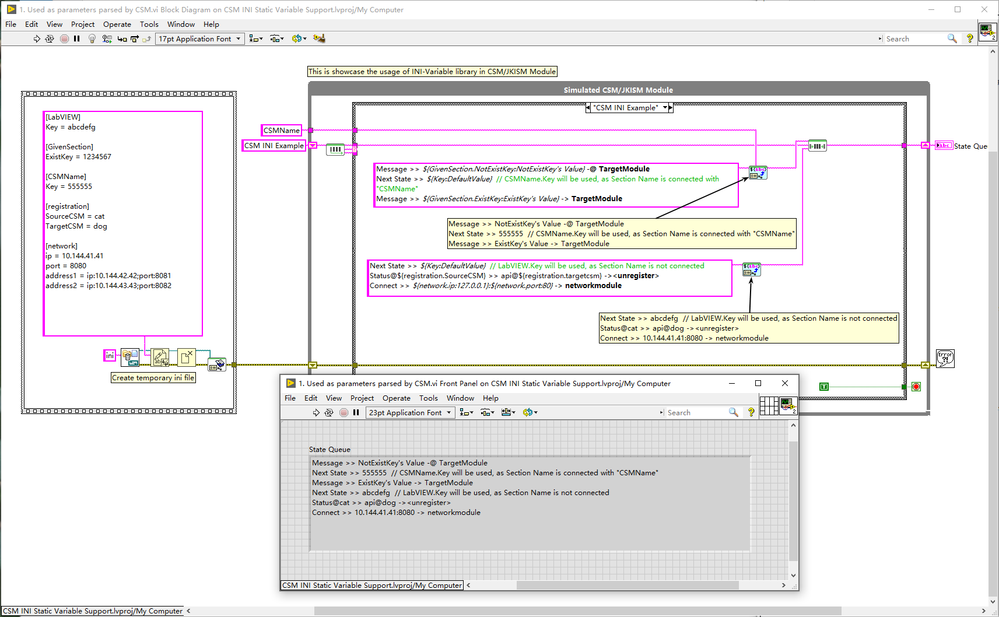
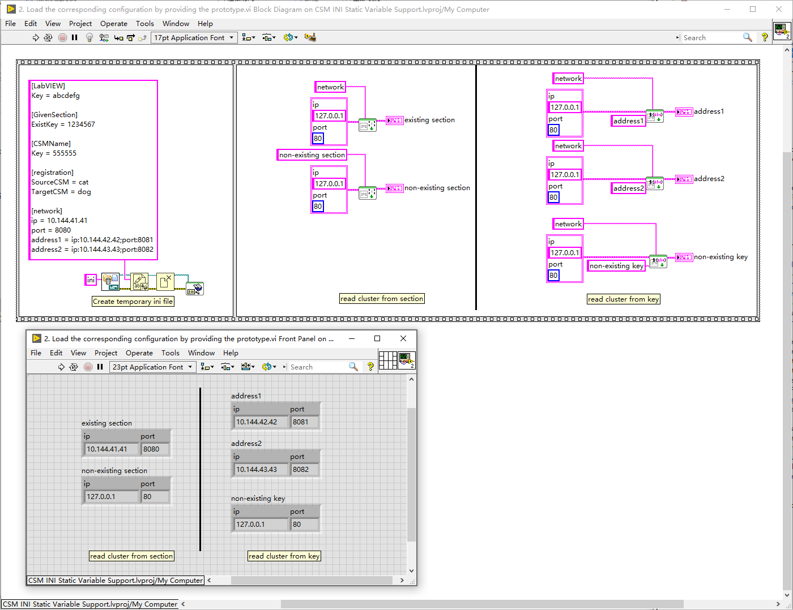
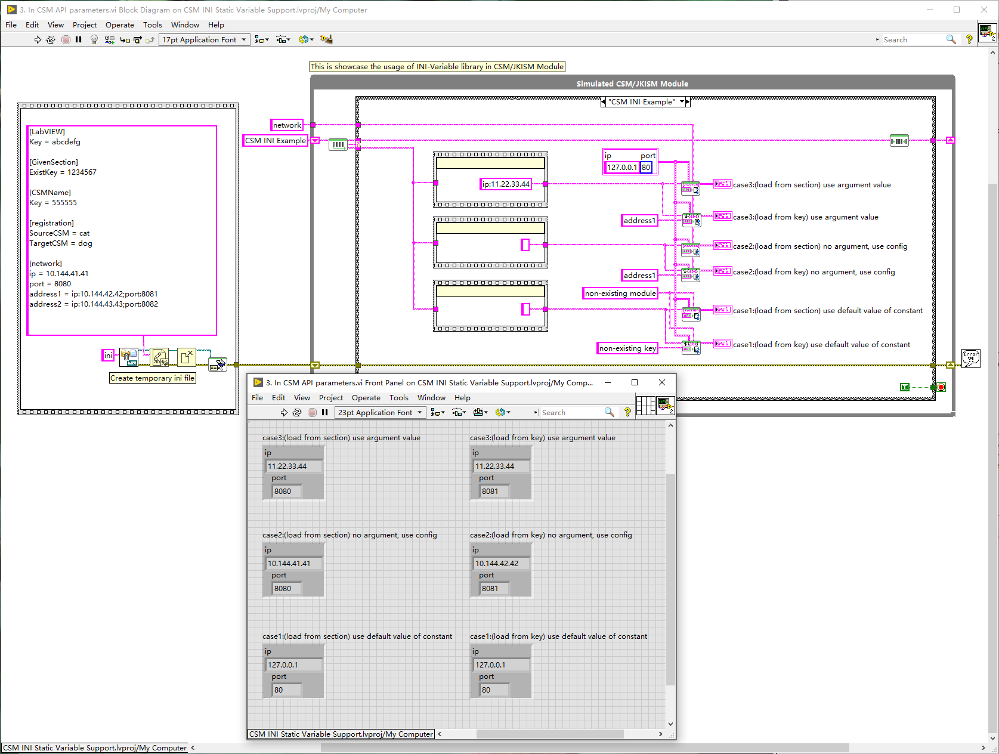
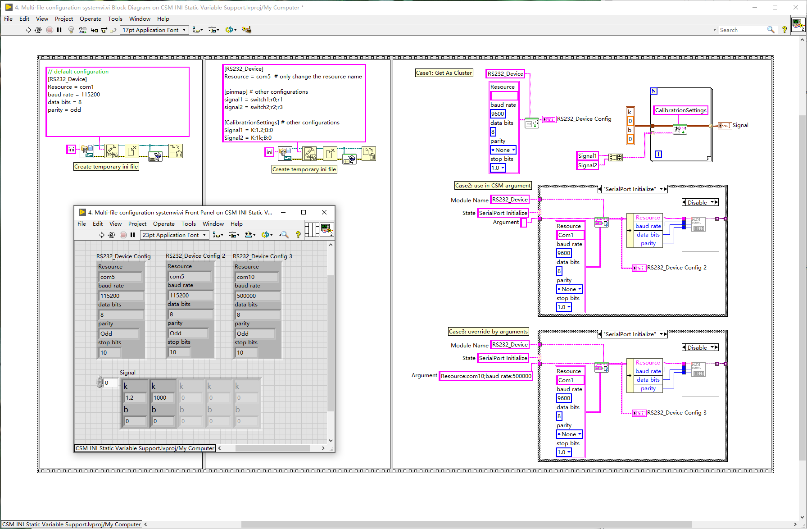
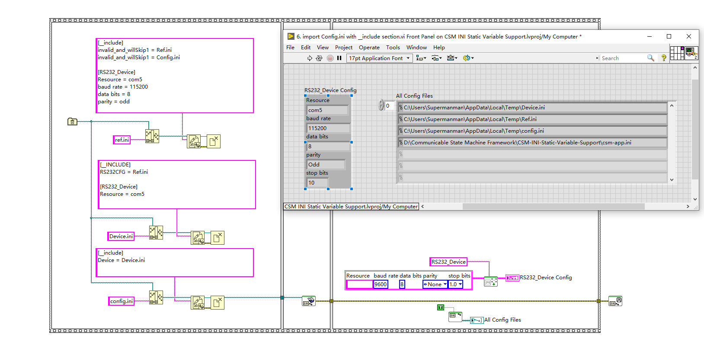
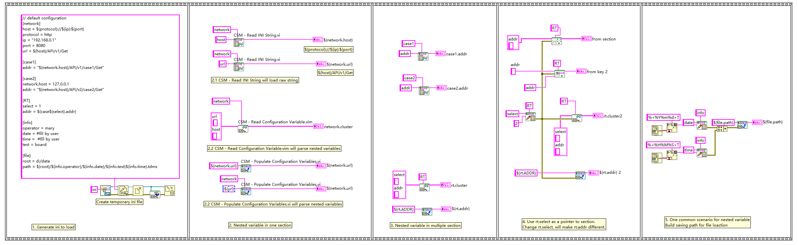

# CSM-INI-Static-Variable-Support

[English](./README.md) | [中文](./README(zh-cn).md)

[](https://www.vipm.io/package/nevstop_lib_csm_ini_static_variable_support/)
[](https://www.vipm.io/package/nevstop_lib_csm_ini_static_variable_support/)
[](https://github.com/NEVSTOP-LAB/CSM-INI-Static-Variable-Support/releases)

配置文件是应用程序开发中不可或缺的组成部分。本库为 CSM 提供简单易用的配置文件支持功能，使用户能够配置应用程序而无需显式读写配置文件。

## 安装

通过 VIPM 安装此库。安装完成后，您可以在 CSM 的 Addon 函数选板中找到该库的函数。

## 架构设计

CSM INI-Static-Variable-Support 库的架构设计如下图所示：



主要特点包括：

1. **默认配置处理**：首次调用库函数时自动加载默认配置文件，无需用户显式加载。
2. **多文件支持**：通过专用函数支持加载多个配置文件。
3. **内存缓存**：在内存中维护一个缓存副本，应用程序从该缓存中获取配置信息。
4. **INI 格式兼容**：配置文件和内存副本均采用标准 INI 格式，支持节和键值对。
5. **高效缓存机制**：使用全局修改标记优化性能，仅在配置发生修改时才重新读取内存副本。

> [!IMPORTANT]
> **开源声明**: 本库包含并使用了由 [@rcpacini](https://github.com/rcpacini) 开发的 [LabVIEW-Config](https://github.com/rcpacini/LabVIEW-Config) 的副本。

> [!NOTE]
> **默认配置文件位置**：
>
> - 开发状态：Application Directory 中找到的第一个 INI 配置文件。若不存在配置文件，则默认为 `csm-app.ini`。
> - 编译后：可执行文件所在目录中与可执行文件同名的 INI 配置文件（LabVIEW 编译后会自动生成此文件）。

> [!NOTE]
> **多文件配置场景**：
>
> - 加载多个文件时，后加载的文件会覆盖先前加载文件中的相同配置项。
> - 将缓存更改保存到文件时，修改会保存到最后加载的配置文件中。

> [!WARNING]
> 请注意，由于本库使用全局缓存修改标志，频繁的配置更改会降低读取 VI 中缓存机制的有效性。因此，本库不建议用于需要频繁修改配置的场景。

## 应用场景

### CSM 可解析参数

为 CSM 提供 `${section.variable:defaultValue}` 语法支持，可直接在 CSM 发送的文本消息中使用。

> [!TIP]
>
> - section 参数为可选。省略时，使用默认配置段 `SectionName=LabVIEW`。
> - 默认值也为可选，未指定时默认为空字符串（""）。



### 基于原型的配置加载

通过提供原型结构加载配置。您可以从整个节或特定键加载配置。



### 固定 CSM API 参数

提供固定 CSM API 参数的功能，具有明确的优先级层次：CSM API 参数 > 配置文件参数 > 默认常量参数。例如，这使得将串口初始化参数固定在配置文件中变得非常简单。

- 初始化时，显式发送的参数具有最高优先级。
- 若未发送参数，则使用配置文件中的参数。
- 在没有配置文件参数的情况下，应用默认常量参数。
- 参数可以部分指定，缺失的值会自动使用下一优先级的配置信息填充。



### 多文件配置系统

利用多文件配置功能，可实现分布式配置文件系统。



### 使用 [__include] 引用配置文件

`[__include]` 节支持引用其他配置文件，便于实现模块化和可重用的配置设置。被引用的文件会被预加载，遵循与多文件场景相同的行为。

> [!TIP]
>
> - 请注意避免循环依赖，否则可能导致无限循环。库会维护已加载配置文件的记录，当第二次尝试加载同一文件时，将跳过该操作。



### 嵌套变量

CSM INI-Static-Variable-Support 支持嵌套变量解析，允许在键中引用其他键，实现更灵活的配置定义。格式遵循 `${section.variable:defaultValue}`。

1. **读取 API 行为**：`CSM INI Read String.vi` 获取原始配置值而不解析嵌套变量。其他所有读取 API 都会自动解析嵌套变量。
2. **写入 API 行为**：所有写入 API 都会直接覆盖配置值。通常情况下，包含嵌套引用的键不应通过写入操作直接修改。

```ini
// 默认配置
[network]
host = ${protocol}://${ip}:${port}
protocol = http
ip = "192.168.0.1"
port = 8080
url = ${host}/API/v1/Get

[case1]
addr = "${network.host}/API/v1/case1/Get"

[case2]
network.host = 127.0.0.1
addr = "${network.host}/API/v2/case2/Get"

[RT]
select = 1
addr = ${case${select}.addr}

[info]
operator = mary
date = #fill by user
time =  #fill by user
test = board

[file]
root = d:/data
path = ${root}/${info.operator}/${info.date}/${info.test}${info.time}.tdms
```

使用上面的配置文件示例：

**场景1**：读取 `${file.path}` 会返回一个由其他配置项动态组合而成的实际文件路径，从而实现灵活的路径定义。

**场景2**：`[case1]` 和 `[case2]` 节定义了两组不同的相关配置信息。通过修改 `${RT.select}`，您可以在访问 `${RT.addr}` 时轻松切换这些配置。

有关更详细的使用示例，请参考示例项目。

