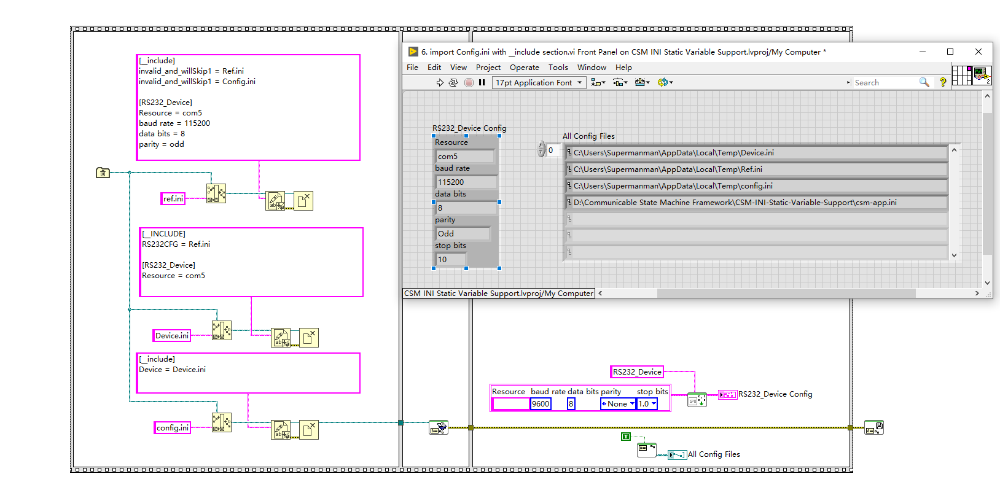

# CSM-INI-Static-Variable-Support

[English](./README.md) | [中文](./README(zh-cn).md)

[](https://www.vipm.io/package/nevstop_lib_csm_ini_static_variable_support/)
[](https://www.vipm.io/package/nevstop_lib_csm_ini_static_variable_support/)
[](https://github.com/NEVSTOP-LAB/CSM-INI-Static-Variable-Support/releases)

配置文件是应用程序必备的功能之一。这个库的目的是为 CSM 提供简单易用的配置文件支持功能，用户可以通过配置文件来配置应用程序，而无需显式读写配置文件。

## 安装

您可以通过 VIPM 安装这个库，安装完毕后，可以在 CSM 的 Addon 函数选板中找到这个库的函数。

## 设计

CSM INI-Static-Variable-Support 库的设计如下图所示：


它的特点有：

1. 支持默认的配置文件，这个配置文件会在第一次调用这个库的函数时隐式加载，无需用户显式加载配置文件。
2. 支持多配置文件，可以通过 Multi-File Support 中的函数来加载多个配置文件。
3. 在内存中创建一个缓存副本，应用程序实际读取的配置信息来源于缓存副本。
4. 配置文件和内存副本都是 ini 文件格式，支持节和键值对。
5. 全局创建了修改标记，能够在读取VI处缓存配置信息，当配置发生修改时才真正再次读取内存副本，效率高。

> [!IMPORTANT]
> **开源声明**: 包含并使用了 [@rcpacini](https://github.com/rcpacini) 的 [LabVIEW-Config](https://github.com/rcpacini/LabVIEW-Config) 的副本。

> [!NOTE]
> 默认配置文件的位置：
>
> - 开发状态：Application Directory 下的第一个 ini 配置文件，没有时默认的配置文件名称为 csm-app.ini
> - 编译后：exe 目录下 exe 同名的 ini 配置文件。(LabVIEW 编译后必然产生这样一个配置文件)

> [!NOTE]
> 多配置文件的场景：
>
> - 加载时，后加载的配置文件会覆盖前加载的配置文件中的相同配置项。
> - 保存缓存到文件时，会将更改保存到后加载的配置文件中。

> [!WARNING]
> 请注意，由于这个库使用一个全局的缓存修改标志，频繁的配置信息修改会导致读取VI处的缓存机制失效，因此这个库不适合频繁修改配置信息的场景。

## 应用场景

### 作为 CSM 的参数被解析后使用

为 CSM 提供 `${section.variable:defaultValue}` 的支持，直接使用在 CSM 发送的文本消息中。

> [!TIP]
>
> - section 可以缺省，默认情况下使用 SectionName=LabVIEW 的配置段。
> - defaultValue 可以缺省，默认为 ""。


### 通过提供 prototype 载入对应的配置

通过提供 prototype 载入对应的配置。既可以从 section 中载入，也可以从 key 中载入。


### 固化 CSM API 参数

提供了固化 CSM API 参数的功能。在这个场景下，CSM API 的参数优先级是：CSM API 参数 > 配置文件参数 > 默认 Constant 参数。例如示例中，很容易将串口初始化的参数固化在配置文件中。

- 初始化时，如果发送了参数，就会使用发送的参数；
- 如果没有发送参数，就会使用配置文件中的参数；
- 如果配置文件中没有参数，就会使用默认的 Constant 参数；
- 参数都可以部分提供，缺省的参数会使用下一级优先级的配置信息。


### 多文件的配置系统

通过多文件的配置系统，可以实现分布式的配置文件系统。


### 通过[__include]实现配置文件的引用

[__include] 可以实现配置文件的引用。这个功能可以实现配置文件的分离和引用。被引用的配置文件相当于多文件的场景下提前载入。

> [!TIP]
>
> - 注意，引用可能造成配置文件的循环引用，导致死循环。内部导入时，会保存载入的配置文件列表，当第二次载入同一个配置文件时，将忽略载入。



### 解析嵌套的变量

CSM INI-Static-Variable-Support 库支持嵌套的变量解析。在 Key中可以引用其他的key，更加灵活的定义配置文件。格式为`${section.variable:defaultValue}`.

1. **读取 API 说明**：CSM INI Read String.vi : 这个API会读取原始的配置信息，不会解析嵌套的变量；其他的读取 API 都会解析嵌套的变量
2. **写入 API 说明**：写入的API都会覆盖配置信息。通常情况下，析嵌套的key不会被写入更改

``` ini
// default configuration
[network]
host = ${protocol}://${ip}:${port}
protocol = http
ip = "192.168.0.1"
port = 8080
url = ${host}/API/v1/Get

[case1]
addr = "${network.host}/API/v1/case1/Get"

[case2]
network.host = 127.0.0.1
addr = "${network.host}/API/v2/case2/Get"

[RT]
select = 1
addr = ${case${select}.addr}

[info]
operator = mary
date = #fill by user
time =  #fill by user
test = board

[file]
root = d:/data
path = ${root}/${info.operator}/${info.date}/${info.test}${info.time}.tdms
```

以此配置文件为例：

**场景1**：读取 ${file.path} 的值，可以读取到一个由其他信息拼接而成的实际路径，这样可以更加灵活的定义路径。

**场景2**: [case1] 和 [case2] 定义了不同的两组相关配置信息，通过修改 ${RT.select} 的值，可以在读取${RT.select}时实现多种配置的切换。

运行范例获取更加详细的信息。

