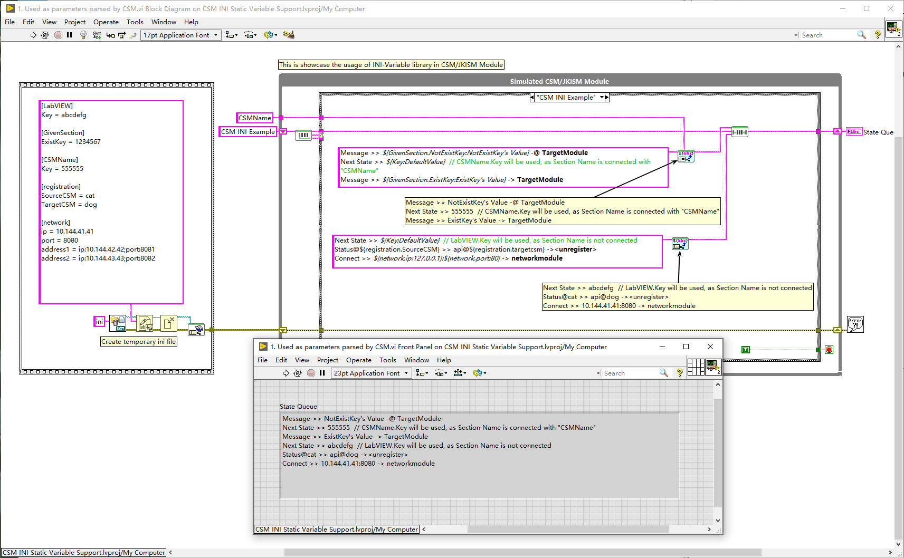
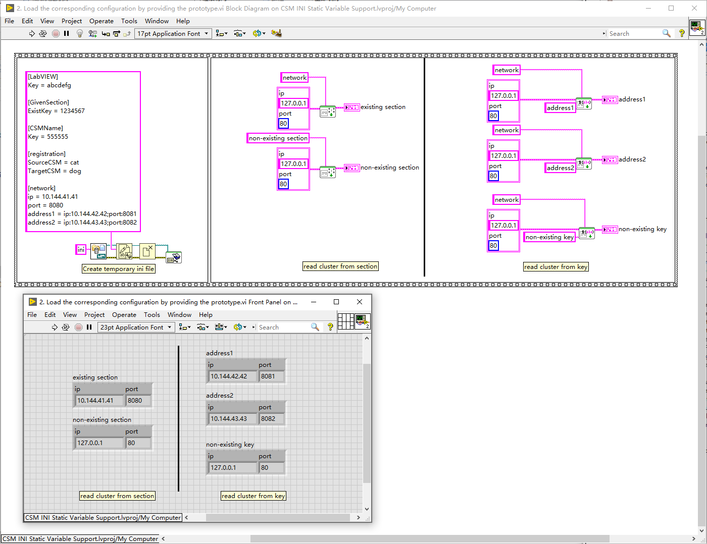
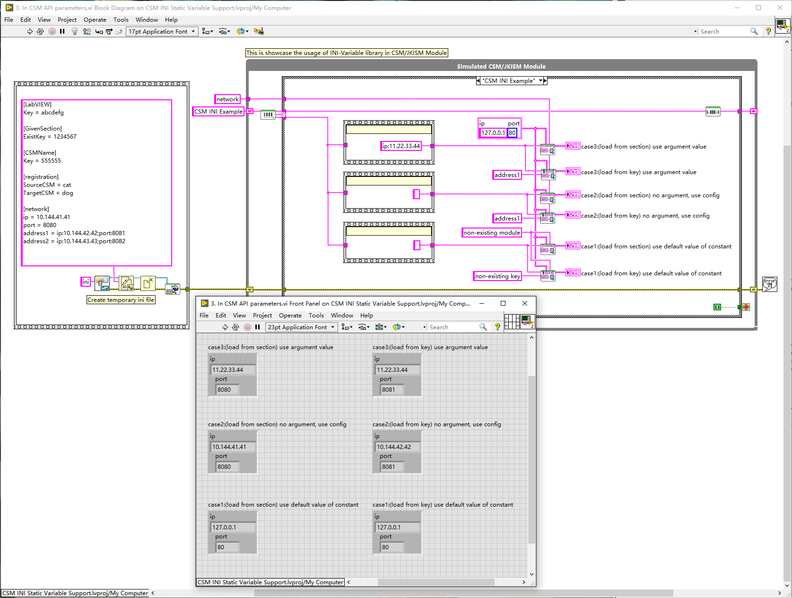
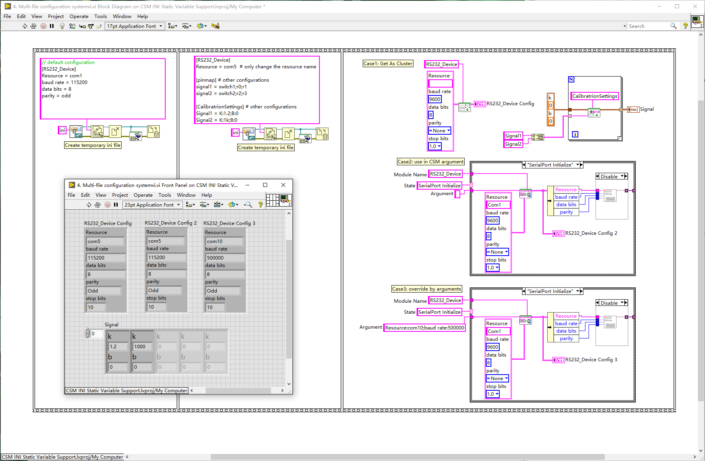
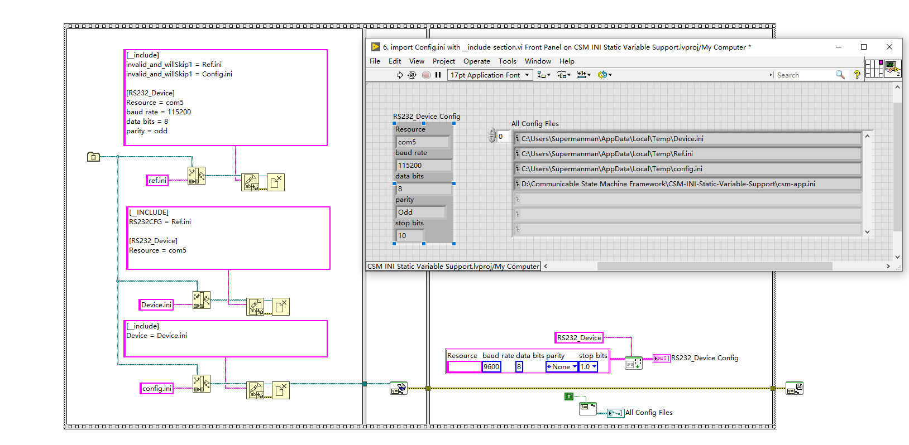
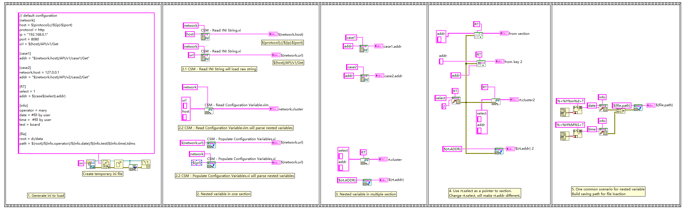

# CSM-INI-Static-Variable-Support

[English](./README.md) | [中文](./README(zh-cn).md)

[](https://www.vipm.io/package/nevstop_lib_csm_ini_static_variable_support/)
[](https://www.vipm.io/package/nevstop_lib_csm_ini_static_variable_support/)
[](https://github.com/NEVSTOP-LAB/CSM-INI-Static-Variable-Support/releases)

Configuration files are essential for application development. This library provides simple and easy-to-use configuration file support for CSM, allowing users to configure applications without explicitly reading or writing configuration files.

## Installation

You can install this library through VIPM. After installation, you can find the library functions in the Addon palette of CSM.

## Design

The design of the CSM INI-Static-Variable-Support library is shown below:



Features include:

1. Support for default configuration files, which are implicitly loaded when the library functions are first called, without requiring users to explicitly load them.
2. Support for multiple configuration files, which can be loaded by the functions in Multi-File Support.
3. Creation of a cache copy in memory, with the actual configuration information read by the application coming from the cache copy.
4. Both the configuration file and the memory copy are in the ini file format, supporting sections and key-value pairs.
5. A global modification flag helps cache configuration information at the read VI, and the memory copy is read again only when the configuration is modified, ensuring efficiency.

> [!IMPORTANT]
> **Open Source Statement**: Contains and uses a copy of [LabVIEW-Config](https://github.com/rcpacini/LabVIEW-Config) from [@rcpacini](https://github.com/rcpacini).

> [!NOTE]
> Default configuration file location:
>
> - In development, the first ini configuration file under the Application Directory, with the default name csm-app.ini if no configuration file exists.
> - After compilation, the exe directory contains an ini configuration file with the same name as the exe. (LabVIEW will inevitably generate such a configuration file after compilation)

> [!NOTE]
> Scenarios with multiple configuration files:
>
> - When loading, the later loaded configuration file will override the same configuration items in the previously loaded configuration file.
> - When saving the cache to a file, changes will be saved to the later loaded configuration file.

> [!WARNING]
> Note that because this library uses a global cache modification flag, frequent configuration changes will cause the cache mechanism at the read VI to fail. Therefore, this library is not suitable for scenarios where configuration information is frequently modified.

## Application Scenarios

### Used as parameters parsed by CSM

Provides `${section.variable:defaultValue}` support for CSM, which can be used directly in text messages sent by CSM.

> [!TIP]
>
> - The section can be omitted. By default, the configuration section is SectionName=LabVIEW.
> - The default value can be omitted, with the default being "".



### Load the corresponding configuration by providing the prototype

Load the corresponding configuration by providing the prototype. You can load from the section or key.



### Fixed CSM API parameters

Provides the function of fixing CSM API parameters. In this scenario, the priority of CSM API parameters is: CSM API parameters > configuration file parameters > default constant parameters. For example, it is easy to fix the parameters of serial port initialization in the configuration file.

- When initialized, if parameters are sent, the sent parameters will be used.
- If no parameters are sent, the parameters in the configuration file will be used.
- If there are no parameters in the configuration file, the default constant parameters will be used.
- Parameters can be partially provided, with missing parameters using the configuration information of the next priority.



### Multi-file configuration system

Implement a distributed configuration file system through the multi-file configuration system.



### Referencing Configuration Files with [__include]

The `[__include]` section allows you to reference other configuration files, enabling modular and reusable configuration setups. Included files are loaded in advance, similar to the multi-file scenario.

> [!TIP]
>
> - Be aware that referencing files can lead to circular dependencies, causing infinite loops. The library maintains a list of loaded configuration files and will skip loading a file if it detects it has already been loaded.



### Nested Variable

CSM INI-Static-Variable-Support supports parsing nested variables, allowing you to reference other keys within a key for more flexible configuration. The format is `${section.variable:defaultValue}`.

1. **Read API:** `CSM INI Read String.vi` reads the original configuration value without parsing nested variables. All other read APIs will automatically resolve nested variables.
2. **Write API:** All write APIs overwrite the configuration value. In general, keys containing nested references are not directly modified by write operations.

``` ini
// default configuration
[network]
host = ${protocol}://${ip}:${port}
protocol = http
ip = "192.168.0.1"
port = 8080
url = ${host}/API/v1/Get

[case1]
addr = "${network.host}/API/v1/case1/Get"

[case2]
network.host = 127.0.0.1
addr = "${network.host}/API/v2/case2/Get"

[RT]
select = 1
addr = ${case${select}.addr}

[info]
operator = mary
date = #fill by user
time =  #fill by user
test = board

[file]
root = d:/data
path = ${root}/${info.operator}/${info.date}/${info.test}${info.time}.tdms
```

For example, with the above configuration file:

**Scenario 1:** Reading the value of `${file.path}` will return an actual file path dynamically assembled from other configuration items, allowing for flexible path definitions.

**Scenario 2:** The `[case1]` and `[case2]` sections define two different sets of related configuration information. By modifying the value of `${RT.select}`, you can easily switch between multiple configurations when accessing `${RT.select}`.

Refer to the sample project for more detailed usage information.

