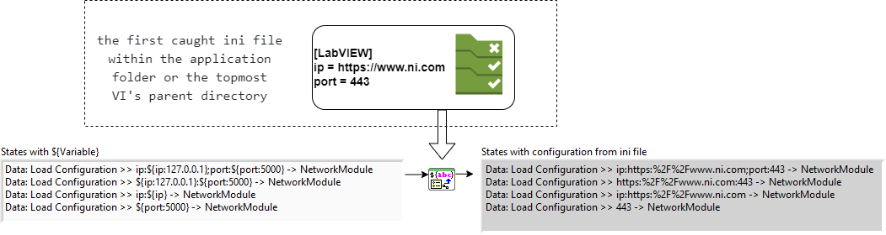

# CSM-INI-Static-Variable-Support

The library is now offering `${variable}` support for CSM, which is loaded from the first caught ini file within the application folder or the topmost VI's parent directory. You can either specify a section name or use the pattern of `${section.variable:defaultValue}` if you leave the section name blank.

**Open Source Declaration**
 - A copy of <b>LabVIEW-Config</b> by @rcpacini is included and used.  Source Repo link: https://github.com/rcpacini/LabVIEW-Config
